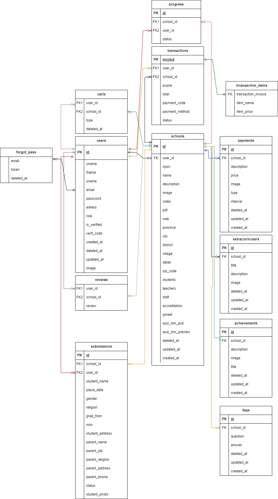
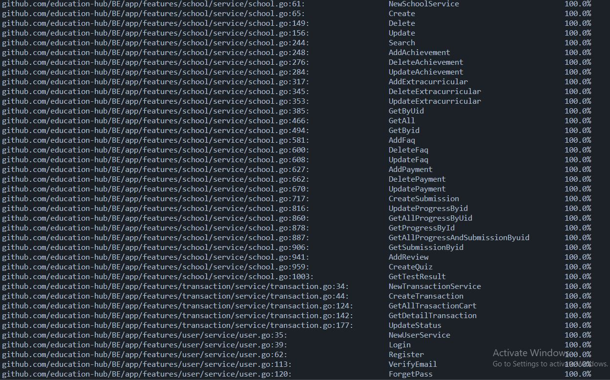
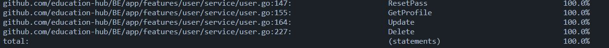

<h1>Welcome to Education Hub,<br> “find your dream school” </h1>


## 📑 ABOUT PROJECT

reach your dream school through your hands without having to go anywhere. Find more details about the school

1. Who are the costumer
   - Administrators who want to promote their school
   - Students who want to find a school
2. What do they suffer from?
   - Promote school
   - Looking for school
3. How do I answer their need?
   - Provides a platform that can make it easier for students to find schools


## 🛠 Technology Stack
<div align="center">


  </div>

# 🔗 ERD

<div align="center">

  </div>


## How to Install To Your Local And Run

- Clone Project App

```
$ git clone https://github.com/education-hub/BE.git
```

- Go to directory

```
$ cd BE
```
- Setup Env
```
Fill in the environment variables in the config.json file to configure your environment.
How to Configure Env:

1. Env Midtrans:
  - Please register at 
    https://midtrans.com/id/passport
  - Fill in the Server Key and Client Key obtained 
    from Midtrans.

2.Env Pusher Js:
  - Please sign up 
    at https://pusher.com

  - Fill in the App ID, Key, Secret, and Cluster.

3.Env GCP (Google Cloud Platform):
  - Please sign up 
    at https://pusher.com
  - Create the credentials.
  - Download the credentials.
  - Set the location of the credentials.
  - Fill in the Project ID and Bucket Name.

4.Env Calendar:
  - Go to the Google Cloud menu.
  - Select "APIs & Services".
  - Create OAuth credentials.
  = Save the credentials with the name "AuthCal" in 
    the root working directory.
5.Env Gmaps:
  - Go to the Google Cloud menu.
  - Select "APIs & Services".
  - Create API credentials.
  - Set the value of the credentials in the GMAPS 
    environment variable.
6.Env Quiz:
  - Please register your account at 
    https://www.flexiquiz.com/.
  - Login to your account.
  - Obtain the value of the cookie named ".ASPXAUTH".
  - Fill in the Env Quiz with the value from that 
    cookie.
```
- Run Docker Compose
```
$ docker-compose up -d
```
- Run Project
```
$ go run main.go
```
- Clone Project Email
```
$ git clone https://github.com/ropel12/project3-email.git
```
- Go to Directory
```
$ cd project3-email
```
- Setup Env
```
 Fill in the environment variables in the config.json 
 file to configure your environment.
```
- Run Project 
```
$ go run main.go
```
## UNIT TEST COVERAGE ALL

<div align="center">


  </div>

## Open Api
Final Project Capstone Program Immersive Alterra Academy
<br />
<a href="https://app.swaggerhub.com/apis/EventPlanning/Education_Hub_Restful_API/1.0.0#/0"><strong>Go to Open API »</strong></a>
<br />

## Authors 👑

- Satrio Wibowo <br> [](https://github.com/ropel12)


 <p align="right">(<a href="#top">back to top</a>)</p>
<h3>
<p align="center">Built with ❤️ by Group 2</p>
<p align="center">©️ May 2023 </p>
</h3>